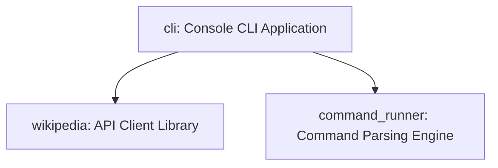

# Dartpedia Monorepo

[](https://dart.dev)
[](https://opensource.org/licenses/MIT)
[](#-testing)

Welcome to **Dartpedia**, a modern, multi-package Dart monorepo workspace that implements a custom command-line interface (CLI) to query, search, and retrieve Wikipedia articles.

---

## Project Structure

This project is organized as a monorepo workspace containing three local packages:



| Package | Path | Description |
| :--- | :--- | :--- |
| **`cli`** | [`cli/`](./cli) | The end-user console application containing commands, logging, and binary executable. |
| **`command_runner`** | [`cli/command_runner/`](./cli/command_runner) | A lightweight command parsing and execution framework. |
| **`wikipedia`** | [`wikipedia/`](./wikipedia) | An asynchronous client library communicating with the Wikipedia API. |

---

## 🚀 Getting Started

### Prerequisites

- [Dart SDK](https://dart.dev/get-dart) `^3.12.0` or higher.

### Installation

1. Clone the repository and navigate to the project directory:
   ```bash
   git clone https://github.com/your-username/dartpedia.git
   cd dartpedia
   ```

2. Resolve all dependencies across the entire workspace in one command:
   ```bash
   dart pub get
   ```

---

## 💻 CLI Usage

Navigate to the `cli/` directory to run the application:
```bash
cd cli
```

### Commands

#### 1. Show Help & Usage
```bash
# General help
dart run bin/cli.dart help

# Verbose description of all commands and options
dart run bin/cli.dart help --verbose

# Get help for a specific command
dart run bin/cli.dart help --command search
```

#### 2. Search Articles
Searches Wikipedia and prints matches.
```bash
# Print list of matching articles and their URLs
dart run bin/cli.dart search "Flutter (software)"

# "I'm Feeling Lucky" - directly prints the top article summary
dart run bin/cli.dart search "Dart programming" --im-feeling-lucky
```

#### 3. View Article
Fetches and prints the content of a specific Wikipedia article.
```bash
dart run bin/cli.dart article "Dart (programming language)"
```

---

##  Logging & Error Handling

Dartpedia implements hierarchical file-based logging for exceptions and run failures.

- **Log File Location**: Logs are written to `cli/logs/YYYY_MM_DD_errors.txt`.
- **Handling**:
  - Warnings are logged for missing search terms or when requested pages cannot be found.
  - Failures are logged automatically without crashing the CLI.

---

## 🧪 Testing

You can run unit tests for any of the modules using Dart's test runner:

```bash
# Run tests for the Wikipedia API client
cd wikipedia && dart test && cd ..

# Run tests for the Command Runner engine
cd cli/command_runner && dart test && cd ../..

# Run tests for the CLI commands
cd cli && dart test && cd ..
```

---

## Built With

- **[Dart](https://dart.dev)** - Programming language.
- **[http](https://pub.dev/packages/http)** - Asynchronous HTTP requests.
- **[logging](https://pub.dev/packages/logging)** - Hierarchical diagnostics logging.
- **[test](https://pub.dev/packages/test)** - Unit testing framework.

---

